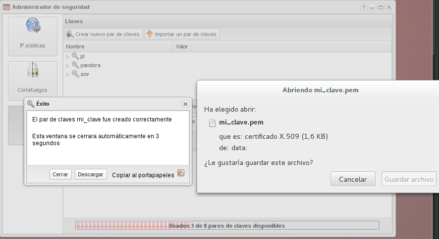
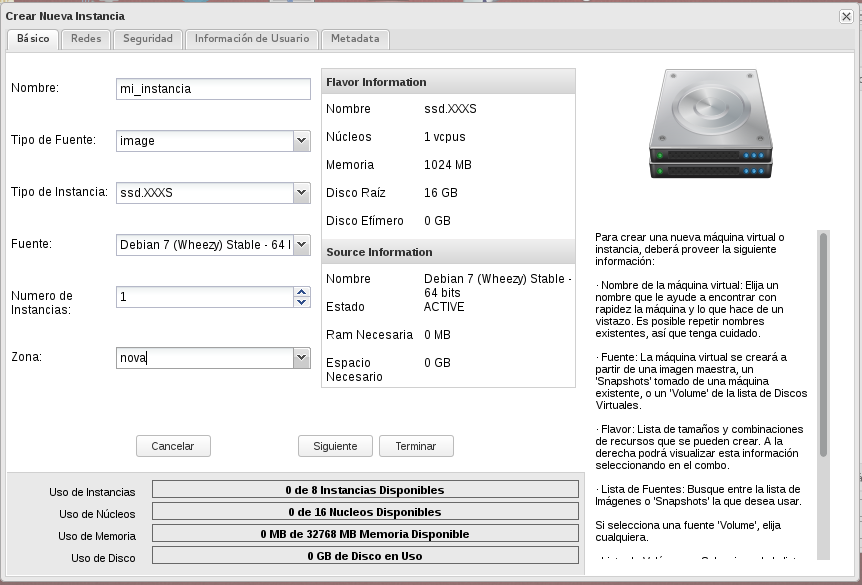
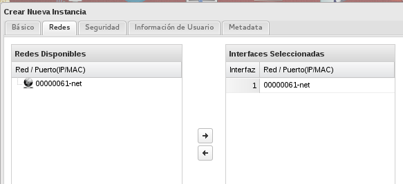
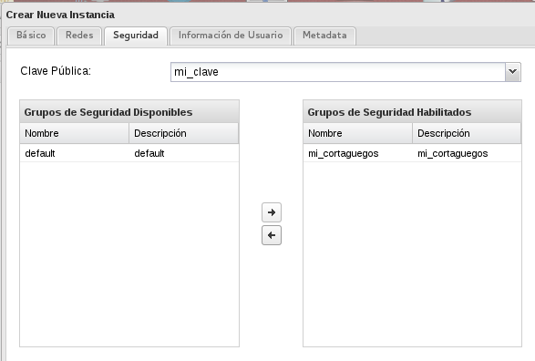
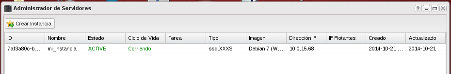
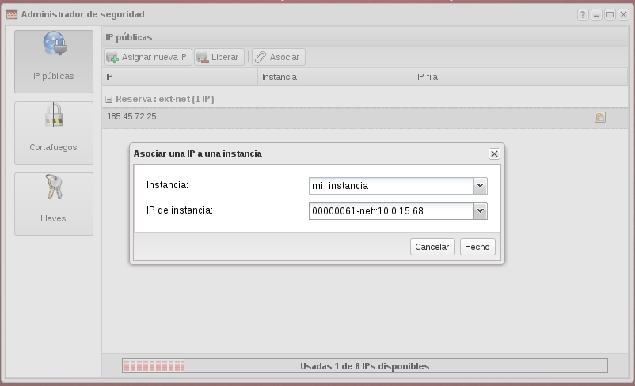

## Demostración 2: Crear una instancia a partir de la imagen Debian (Asignar IP flotante, acceso a la instancia)

El objetivo de esta demostración es la creación de una instancia Linux a partir de una de las imágenes que disponemos en StackOps. Veamos los pasos que tenemos que dar para alcanzar nuestro objetivo:

1. Lo primero que vamos a hacer es crear nuestro par de claves, desde la
sección **Administrador de Seguridad** -> **LLaves** -> **Crear nuevo par de claves**:

	Al crearse el par de claves, el sistema almacena la clave pública del usuario y envía al usuario la clave privada. Nos descargamos la clave privada, almacenándola en nuestro y le asignamos los permisos adecuados para que ningún otro usuario pueda leerla: *chmod 600*.

	

2. Antes de crear la instancia nos vamos a detener en los Grupos de Seguridad o Cortafuegos en la terminología de StackOps.

	Para acceder al cortafuego, elegimos la pantalla **Administrador de seguridad** y la opción **Cortafuegos**. Después de la experiencia previa que hemos tenido es recomendable crear un nuevo grupo de seguridad, además del existente *default*. Un grupo de seguridad es un conjunto de reglas iptables que podemos usar para gestionar el acceso a nuestras instancias. Y vamos a añadir una nueva regla que permita el acceso desde nuestro ordenador.

    

3. Ya podemos crear nuestra instancia en el apartado **Administrador de Servidores**, tenemos que indicar los siguientes datos:

	* El primer panel es utilizado para Indicar el flavor y la imagen que se aplicarán al servidor. Los valores a Introducir son:
        * Nombre : El nombre que pondremos al servidor virtual.
        * Tipo de Fuente : Indica si vamos a crear el servidor a partir de una imagen, un snapshot o un volumen de arranque.
        * Tipo de Instancia : Se debe elegir el nombre de un flavor a aplicar en la creación, las características del flavor elegido se muestran en el mismo panel en la parte central.
	    * Fuente : Indicamos la imagen virtual, el snapshot o el volumen que queremos utilizar para instalar el sistema operativo de nuestro servidor. Las características de esta imagen se muestran en la parte central del panel.
        
    * En el segundo panel se indican las redes a las cuales queremos que pertenezca nuestro servidor, es decir donde nuestro servidor virtual tendrá una IP fija.
    
    * En el Tercer panel se gestionan temas de seguridad. Los datos a indicar son:
    	* Clave Pública: Se selecciona una clave pública de una lista de claves públicas creadas previamente en el plugin de Administrador de Seguridad.
    	* Se selecciona uno o más grupos de seguridad para aplicar en el servidor a la hora de gestionar el tráfico en la red. 
    	

4. Al cabo de unos segundos podemos ver que nuestra instancia ha sido creada, que tiene asignada una IP fija: 

	Además podemos realizar diferentes acciones sobre ella:

5. Por último para poder acceder a la instancia desde el exterior tenemos que asignar a la instancia una IP flotante, una IP Pública, para ello:

	* Elegimos la opción **IP públicas** en el apartado **Administrador de seguridad** y asignamos una nueva IP.
	* Desde esa misma pantalla o desde la **Adminstración de servidores**, asignamos esa nueva IP a la instancia que acabamos de crear.
		
	* ecuerda que una vez que la IP pública no está asignada a una instancia se puede liberar.

6. Ya estamos en disposición de acceder a la instancia:

	
