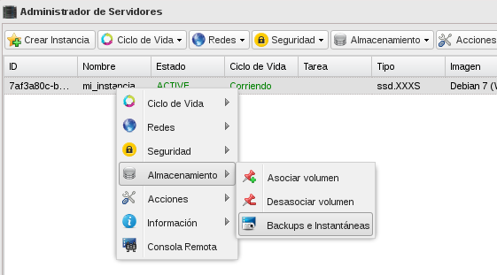
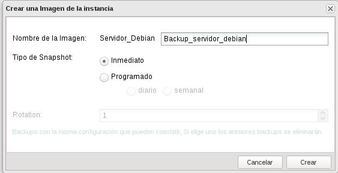
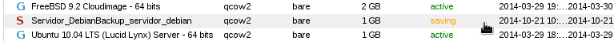
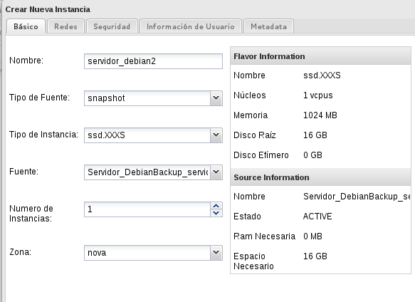

## Demostración 3: Trabajar con Snapshots/Backup

### Snapshot (Instantáneas)

En cualquier momento puedo crear una instantánea de una instancia, con lo que se creará una nueva imagen con el estado actual de la instancia. Puedo crear una nueva instancia a partir del snapshot. Veamos como se hace partiendo de una instancia Linux Debian que estamos corriendo.

1. Vamos a acceder a la instancia y vamos a realizar un cambio sobre ella, lo mas sencillo es crear un fichero de texto.

		$ ssh -i smr.pem debian@185.45.72.103
		debian@servidor-debian:~$ touch fichero_prueba.txt

2. A continuación vamos a realizar un snapshot a la instancia, con lo que se nos creará una nueva imagen desde la que podremos crear nuevas instancias.

	* Creamos el snapshot escogiendo la opción de **Backups e Instantáneas**:
	
		
	* Y podemos observar que en **Catálogo de imágenes** encontramos una nueva imagen:
	
	* A continuación podemos crear una nueva instancia a a partir de esta instantánea:
	
	
	* Y por último podemos acceder a la nueva instancia (a la que le hemos asignado una nueva IP pública y a la que hemos asocuiado la clave SSH smr.pem), y comprobar que tiene el fichero que creamos en la instancia anterior:
		
		$ ssh -i smr.pem debian@185.45.72.104
		debian@servidor-debian2:~$ ls
		fichero_prueba.txt

### Backups

StackOps también nos ofrece la opción de Backup que nos permite programa la creación de snapshots cada cierto tiempo.

	

El campo **Rotación** es el número de snapshots creados a partir de este backup que se desean mantener.