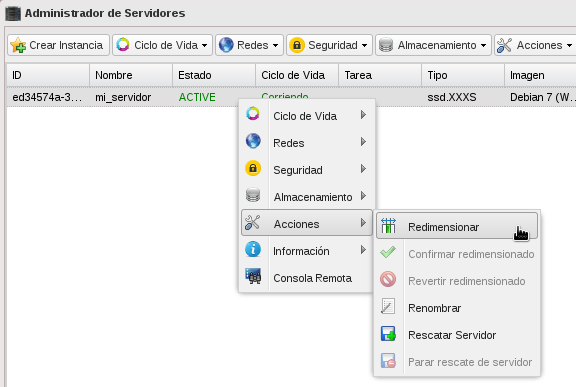
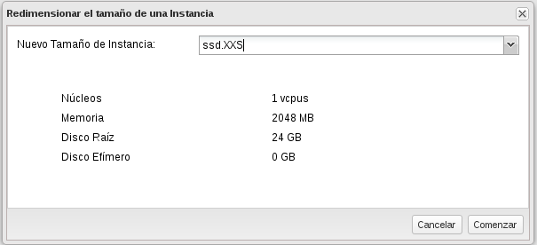
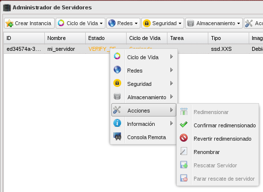
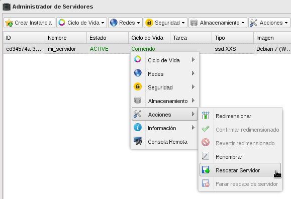
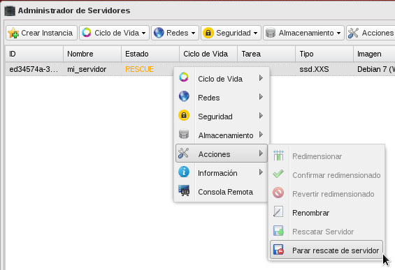

##Gestión avanzada de instancias: redimensión y rescate.

### Redimensión de instancias

Esta acción sirve para cambiar las características hardware del servidor, a través de asociar un flavor diferente al mismo. Para Realizar estas operaciones el usuario deberá seleccionar el servidor y elegir la opción de **Redimensionar**.

Para terminar la operación se puede **Confirmar la redimensión**, o **Revertir la redimensión**. Para realizar estas operaciones el usuario deberá seleccionar el servidor en estado de VERIFY_RESIZE.

* Hemos creado una instancia con un flavor ssd.XXXS, y la vamos a redimensionar:

* Elegimos otro flavor.

* Terminamos confirmando o revirtiendo la redimensión

### Rescatar una instancia

Un usuario puede poner una máquina virtual en modo de rescate, de esta forma se puede acceder al servidor con una nueva contraseña y corregir cualquier sistema de fichero o errores de configuración.
Se puede poner un servidor en modo rescate a un servidor que no permite acceder al sistema debido a diferentes errores. Cuándo se pone un servidor en modo rescate no se puede acceder a él hasta que este cambia de ACTIVE a RESCUE, esto proceso puede tardar un poco.

Cuando un usuario se pone en modo de rescate, se activa el siguiente proceso :

* El servidor virtual se apaga.
* Un nuevo servidor virtual es creado con las siguientes imágenes enlazadas:
    * Imagen primaria: Imagen desde la que se arrancó originalmente el servidor virtual, que será utilizada para arrancar el nuevo servidor para arreglar los problemas.
    * Disco Secundario: Imagen del servidor que necesita ser rescatado.

Después de resolver los problemas de un servidor en modo rescate, se puede detener este modo. Cuando se detiene el rescate del servidor, la imagen reparado se restaura a su estado de funcionamiento con su contraseña original.

