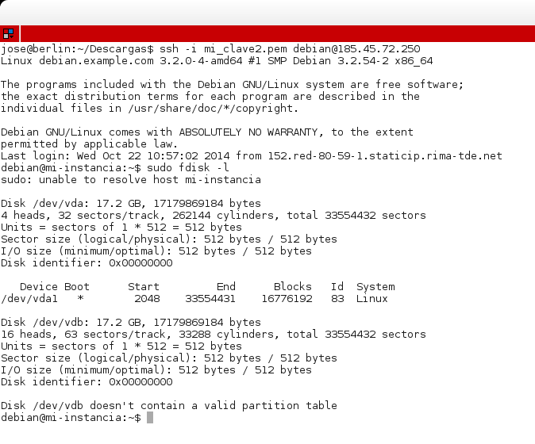
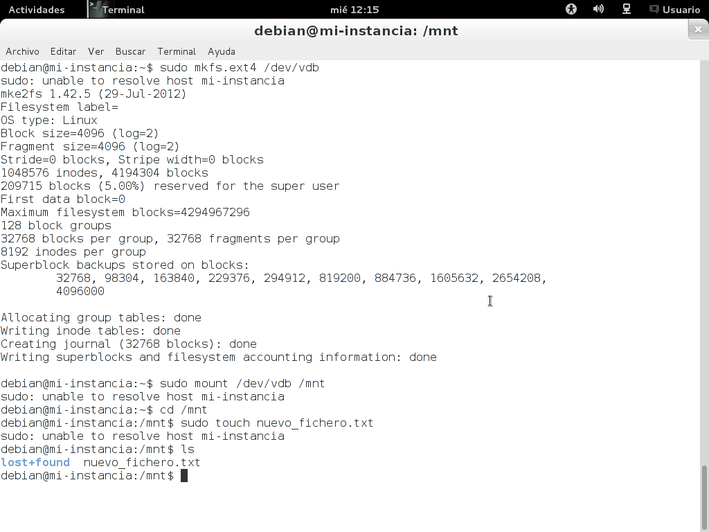
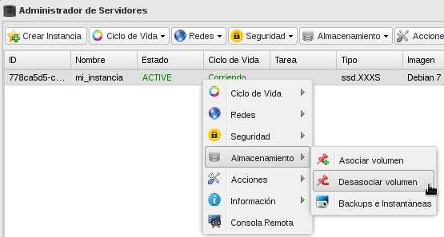
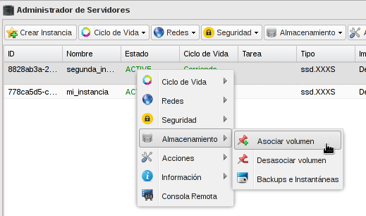
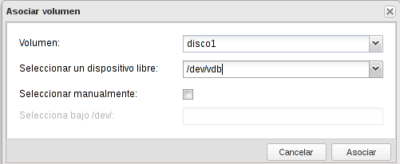
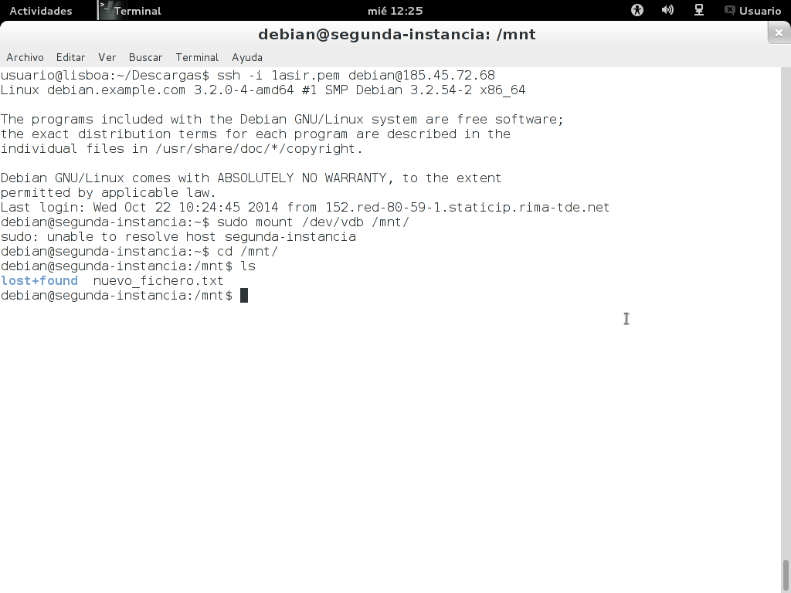

--
layout: blog
tittle: Utilización de OpenStack (2)
menu:
  - Unidad 3
---

##Instantáneas de volúmenes

Al igual que podemos hacer instantáneas de nuestras instancias para posteriormente crear nuevas instancias a partir de esa copia, podemos hacer del mismo modo instantáneas de nuestro volúmenes, y crear nuevos volúmenes a partir de copias que hemos hecho anteriormente.

En esta demostración vamos a realizar cambios sobre un volumen asociado a una instancia, le vamos a crear un snapshot, y posteriormente vamos a comprobar que un volumen creado a partir de la instantánea conserva la misma información. Vamos a realizar los siguientes pasos:

1. Partimos de un escenario donde tenemos corriendo una instancia con Linux Debian, que tiene asociado un volumen. Vamos a formatear el volumen, lo vamos a montar y vamos a crear un fichero en él.

2. Desasociamos el volumen de la instancia y creamos una instantánea del mismo con la opción **Imagen del volumen** en el **Gestor de discos**:

 

	Se mostrará un formulario donde el usuario deberá proporcionar la siguiente información:

    * Nombre de la imagen: Parámetro obligatorio. Proporcionamos el nombre que le daremos a la nueva imagen.
    * Formato del contenedor: De la lista que se muerta podemos indicar el contenedor de la imagen. Los formatos disponibles son:
        * aki: Indica que se almacena una imagen kernel de amazon.
        * ari: Indica que se almacena una imagen de un disco ram de amazon.
        * ami: Indica que se almacena una imagen de máquia amazon.
        * bare: Indica que no existe un contenedor o metadata
        * ovf: Formato de contenedor OVF.
    * Formato del disco: De la lista que se muestra podemos indicar el formato de disco. Los formatos disponibles son:
        * qcow2 : Soportado por el emulador QEMU que puede expandirse de forma dinámica y soportar copiar al escribir (copy-on-write).
        * raw : Un formato de imagen de disco desestructurado, si se tiene un fichero sin extensión entonces probablemente se trate de un formato raw.
        * iso : Un formato de archivo para datos contenidos en un disco óptico, como por ejemplo un CD-ROM.
        * vmdk : Formato de disco común, soportado por muchos monitores de servidores virtuales.
        * aki : Una imagen kernel de Amazon.
        * ami : Una imagen de máquina Amazon.
        * ari : Indica que se almacena una imagen de un disco ram de amazon.
        * vhd : Formato de disco VHD, usado usualmente por monitores de máquinas virtuales VMWare, Xen, Microsoft, VirtualBox, entre otros.
        * vdi : Formato de disco soportado por monitores de máquinas virtuales virutalBox y emuladores QEMU
    * Forzar : Indicamos que si queremos que se fuerce la creación de la imagen.

    

3. Podemos observar en **Catálogo de imágenes** encontramos una nueva imagen de volumen, que podremos utilizar posteriormente para crear nuevos discos.

4. Como hemos dicho creamos un nuevo disco a partir de esta imagen.

5. Y asociamos este nuevo disco a otra instancia que tenemos corriendo con Linux Debian.

6. Por último montamos ese nuevo disco en la nueva instancia, y comprobamos que las modificaciones que habíamos hecho en el disco anterior se conserva en este nuevo.

