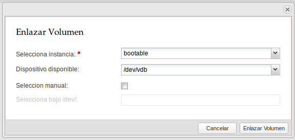
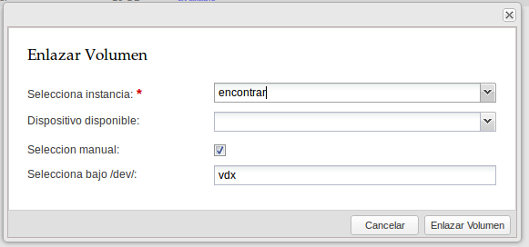

### Creación de volúmenes

Podemos definir un volumen como un dispositivo de bloques que se puede asociar y
desasociar de una instancia cuando se desee. Se puede usar para proporcionar
almacenamiento permanente o independiente de la vida de una instancia.

Los pasos para crear un nuevo volumen son los siguientes:

Accedemos al apartado **Gestor de discos** y a la opción **Crear Volumen**:

A continuación hay que  introducir la siguiente información:

* Nombre del Volumen: Proporcionamos el nombre que queremos asignar a nuestro volumen.
* Tamaño: Indicamos el tamaño en gigabytes que tendrá el nuevo disco.
* Tipo: De la lista desplegable indicamos de qué tipo será el volumen a
crear. Esta opción depende de que haya más de un tipo definido en el cloud que
estemos utilizando o no.
* Imagen: Parámetro opcional. Este campo se indica si se quiere crear un disco
  de arranque que contendrá la configuración de la imagen indicada.
* Descripción: Parámetro opcional. Una breve descripción acerca del disco.

Si el volumen no está asociado a una instancia lo podemos eliminar.

### Asociar un volumen a una instancia

Esta acción sirve para proporcionar almacenamiento secundario (extra) a una
instancia. Para realizar la asociación podemos presionar del menú superior el
botón de **Asociar**. 
    
A continuación se mostrará un formulario donde indicaremos la siguiente
información:

* Selecciona instancia: Parámetro obligatorio. Se muestra una lista con las
instancias existentes.
* Dispositivo disponible: Muestra una lista de dispositivos de bloques
disponibles en el sistema. 
* Selección manual: Si queremos definir otro dispositivo asociado al volumen
diferente a los que aparecen en la lista **Dispositivo disponible**. Al
seleccionar esta opción se habilitará el campo de Selecciona bajo /dev/.
* Selecciona bajo /dev/: En este campo indicamos el path que le corresponderá al
volumen dentro del servidor virtual. Por ejemplo si introducimos vdx, nuestro
volumen corresponderá a /dev/vdx. 

Asociar un volumen de los dispositivos disponibles

Asociar un volumen manualmente

