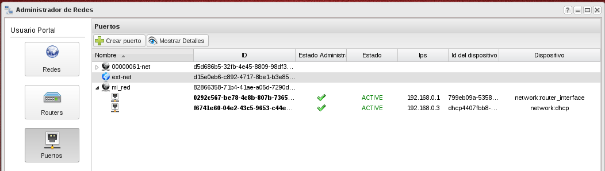

## Demostración 1: Creación de red y subred.

El esquema de red por defecto que nos encontramos en nuestro proyecto esta definido por un router conectado a la red externa, y una red interna donde se conectan las instancias. Podríamos resumirlo en el siguiente esquema:

En esta demostración vamos a crear una nueva red, una nueva subred y un nuevo router. El router estará conectado a la red externa y a la nueva red creada. El esquema de red sería el siguiente:

1. En el apartado **Administrador de redes** vamos a crear una nueva red.

	

2. A continuación seleccionamos la red creada y creamos una subred. Los datos que podemos introducir en esta pantalla son los siguientes:

   	* Nombrere de la Subred: El usuario deberá indicar un nombre a proporcionarle a la subred.
	* Dirección de red: Se debe introducir un CIDR válido, el cual indicará un bloque de direcciones IPs.
	* Principio de rango: Indica el principio de las direcciones IPs que se utilizarán para asignar IPs a los servidores virtuales. Esta dirección debe pertenecer a las direcciones del CIDR. Debe ser menor que la IP especificada en Final de Rango.
	* Final de rango: Indica el final de las direcciones IPs que se utilizarán para asignar IPs a los servidores virtuales. Esta dirección debe pertenecer a las direcciones del CIDR. Debe ser mayor que la IP especificada en Principio de Rango.
	* Gateway IP: Dirección IP que especificamos para la puerta de enlace. Debe pertenecer a las direcciones del CIDR. Si se especifica este valor tenemos que comprobar que esta dirección no se superpone a alguna dirección del pool de direcciones.
	* Servidores DNS : El usuario puede especificar una lista de dns. Este campo se introduce separado por comas.
	* Versión IP: Se especifica la versión de las direcciones IPs.
	* DHCP habilitado: Especificamos si queremos que el DHCP este activo.

	

3. A continuación vamos a crear un router, podemos también indicar si va a estar conectado a la red externa.

	

4. A continuación vamos a conectar la nueva red al router que hemos creado, para ello seleccionamos la subred y escogemos la opción **Enlazar subred**.

	

5. Podemos comprobar en la lista de puertos que nuestro router esta conectado a nuestra nueva red.

	
