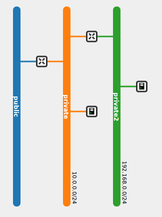

En esta demostración vamos a crear una nueva red, una nueva subred y un nuevo router. El router estará conectado a las dos redes internas. El esquema de red sería el siguiente:

1. En el apartado **Administrador de redes** hemos creado una red nueva con un subred con direccionamiento 192.168.0.0/24 y un nuevo router. Al crear el router no he indicado la **Red externa**, por lo que no estará conectada a esa red.

	

2. 
