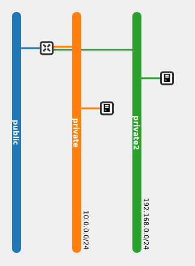

## Tarea

1. Vamos a construir otro esquema de red, en este caso sólo vamos a trabajar con el router que viene creado por defecto. Comprueba que las dos instancias tienen conectividad y que a las dos se le puede asociar una ip pública.

		